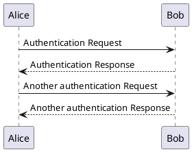

+++
title = "plantuml"
date = "2022-03-04T23:50:40+08:00"
tags = ["plantuml"]
image = ""
comments = true	# set false to hide Disqus
share = true	# set false to hide share buttons
menu= ""		# set "main" to add this content to the main menu
author = "uzzzzz"
description = "引入 plantuml 测试"
+++

