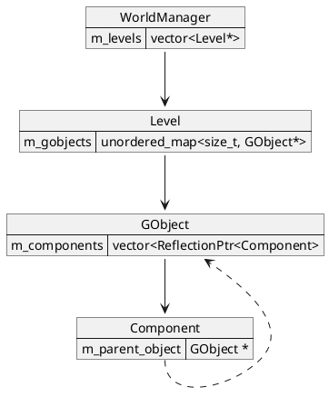

想要分析 WorldManager 就要先从GameObject(GO) 开始，
在Pilot内叫做GObject

## GameObject



位于`engine\source\runtime\function\framework\object\object.h`

GameObject 使用的组件模式
可以拥有不同的组件，代表拥有不同的行为。

### tick

首先先看WorldManager::tick

```cpp
void WorldManager::tick(float delta_time)
{
    processPendingLoadWorld();

    for (Level* level : m_levels)
    {
        level->tickAll(delta_time);
    }
}
```

`processPendingLoadWorld`加载世界因为init时没加载而是推迟到第一次tick时，具体的等会分析。

世界已经加载了那么就可以tick他了，遍历世界内所有的level执行tickAll

## Level::tickAll

```cpp
void Level::tickAll(const float delta_time)
{
    for (const auto& id_object_pair : m_gobjects)
    {
        assert(id_object_pair.second);
        if (id_object_pair.second)
        {
            id_object_pair.second->tick(delta_time);
        }
    }
    SceneManager::getInstance().syncSceneObjects();
}
```

更新Level管理的所有GObject，
让后执行SceneManager 的syncSceneObjects这个以后在分析。

```cpp
void GObject::tick(float delta_time)
{
    for (auto& component : m_components)
    {
        component->tick(delta_time);
    }
}
```

更新GObject管理的所有Component。

```cpp
void GObject::tick(float delta_time)
{
    for (auto& component : m_components)
    {
        component->tick(delta_time);
    }
}
```

为每一个 组件更新 tick

### load

processPendingLoadWorld

```cpp
void WorldManager::processPendingLoadWorld()
{
    if (m_pending_load_world_path.empty())
        return;
    // ...
    WorldRes world_res;
    AssetManager::getInstance().loadAsset(m_pending_load_world_path, world_res);
    m_pending_load_world_path.clear();
    if (world_res.m_name == m_current_world_name)
        return;

    clear();

    loadWorld(world_res);
}
```

世界没加载，
`AssetManager::loadAsset`内部是将`m_pending_load_world_path`的内容读取，通过反射将值设置给`world_res`，
然后执行`clear`清理旧的数据，
最后执行`loadWorld`加载`world_res`。

loadWorld的代码片

```cpp
void WorldManager::loadWorld(const WorldRes& pending_load_world)
{
    // m_world = pending_load_world;
    m_current_world_name = pending_load_world.m_name;

    typedef std::unordered_set<size_t> TypeIDSet;
    for (const std::string& level_url : pending_load_world.m_levels)
    {
        loadLevel(level_url);
    }
}
```

对`pending_load_world`的`m_levels`遍历执行`loadLevel`

引擎默认加载的文件
`engine\asset\world\hello.world.json`

```json
{
  "name": "HelloWorld",
  "levels": [
      "asset/level/1-1.level.json"
  ]
}
```

```cpp
void WorldManager::loadLevel(const std::string& level_url)
{
    Level* level = new Level;
    level->load(level_url);
    m_levels.push_back(level);

    if (m_current_active_level == nullptr)
    {
        m_current_active_level = level;
    }
}
```

创建一个`Level`并执行`Level::load`，让后将其加入 `m_levels`

```cpp
void Level::load(const std::string& level_res_url)
{
    m_level_res_url = level_res_url;

    AssetManager& asset_manager = AssetManager::getInstance();

    LevelRes level_res;
    asset_manager.loadAsset(asset_manager.getFullPath(level_res_url), level_res);

    for (const ObjectInstanceRes& object_instance_res : level_res.m_objects)
    {
        createObject(object_instance_res);
    }
}
```

设置`m_level_res_url`，`getFullPath`是将相对路径转换成绝对路径，
通过反射加载到 level_res，遍历`m_objects`执行`createObject`。

```cpp
const size_t Level::createObject(const ObjectInstanceRes& object_instance_res)
{
    size_t   gobject_id = PILOT_INVALID_GOBJECT_ID;
    GObject* gobject    = new GObject(m_next_gobject_id);
    assert(gobject);
    if (gobject == nullptr)
    {
        LOG_ERROR("cannot allocate memory for new gobject");
    }
    else
    {
        bool is_loaded = gobject->load(object_instance_res);
        assert(is_loaded);
        if (is_loaded)
        {
            gobject_id = m_next_gobject_id;
            m_gobjects.emplace(gobject_id, gobject);
            ++m_next_gobject_id;
        }
        else
        {
            LOG_ERROR("loading object " + object_instance_res.m_name + " failed");
            delete gobject;
        }
    }
    return gobject_id;
}
```

首先new GObject（没使用std::noexcept ？），判断为空就以错误打印日志，
否则创建成功则执行GObject::load来加载，
加载成功则 放入 `m_gobjects`，`m_next_gobject_id`自增，
创建失败则delete gobject。

### GObject::load

GObject::load代码有点长分段介绍，先贴上json数据
格式如下

```json
{
  "objects": [
    {
      "name": "Player",
      "transform": {
        "position": {
            "x": 3,
            "y": 3,
            "z": 0
        },
        "rotation": {
            "x": 0,
            "y": 0,
            "z": 0,
            "w": 1
        },
        "scale": {
            "x": 1,
            "y": 1,
            "z": 1
        }
      },
      "definition": "asset/objects/character/player/player.object.json"
    }
  ]
}
```

```cpp
setName(object_instance_res.m_name);

// load transform component
const Transform& transform               = object_instance_res.m_transform;
auto             transform_component_ptr = PILOT_REFLECTION_NEW(TransformComponent, transform, this);
m_components.push_back(transform_component_ptr);
m_component_type_names.push_back("TransformComponent");

// ...
```

先通过反射构造对象，放到`m_components`，将组件名放入`m_component_type_names`。

`PILOT_REFLECTION_NEW`是new一个对象 通过反射设置对应的值，第一个参数是对象类型，后面的参数传递给对象的构造方法。

明白反射都干了什么要先看`TransformComponent`类型有什么方法、属性。重点关注下面

```cpp
REFLECTION_TYPE(TransformComponent)
CLASS(TransformComponent : public Component, WhiteListFields)
{
    REFLECTION_BODY(TransformComponent)
    // ...

public:
    Vector3    getPosition() const { /* ... */ }
    Vector3    getScale() const { /* ... */ }
    Quaternion getRotation() const { /* ... */ }
    void setPosition(const Vector3& new_translation) { /* ... */ }
    void setScale(const Vector3& new_scale) { /* ... */ }
    void setRotation(const Quaternion& new_rotation) { /* ... */ }

    // ...
};

REFLECTION_TYPE(Vector3)
CLASS(Vector3, Fields)
{
    REFLECTION_BODY(Vector3);

public:
    float x {0.f};
    float y {0.f};
    float z {0.f};

    // ...
};

REFLECTION_TYPE(Quaternion)
CLASS(Quaternion, Fields)
{
    REFLECTION_BODY(Quaternion);

public:
    float w {1.f}, x {0.f}, y {0.f}, z {0.f};

    // ...
};
```

可以看到反射的逻辑有如下几种情况
> 有同名属性：直接设置对应值
> 第一个字母转换成大写后拼在set后：值是一个可以反射构建的对象，尝试反射构建
> stl容器库特殊处理

```cpp
// load object instance components
TypeNameSet instance_component_type_set;
if (loadComponents(object_instance_res.m_instance_components, instance_component_type_set) == false)
    return false;
```

加载instance组件，`loadComponents`等会分析。贴一个用了该组件的GObject
```json
{
  "objects": [
    {
      // ...
      {
        "name": "WallBlock_1",
        "transform": {
          // ...
          "instance_components" : [
            "asset/objects/environment/wall/rigid_body/wall_block.rigid_body.component.json"
          ]
        }
      },
      // ...
    }
  ]
}
```

#### GObject::loadComponents

```cpp
bool GObject::loadComponents(const std::vector<std::string>& components,
                                 TypeNameSet&                    out_instance_component_type_set)
{
    AssetManager&          asset_manager = AssetManager::getInstance();
    ComponentDefinitionRes definition_res;

    for (const std::string& definition_res_path : components)
    {
        asset_manager.loadAsset(asset_manager.getFullPath(definition_res_path), definition_res);
        if (loadComponentDefinition(definition_res, false, out_instance_component_type_set) == false)
            return false;
    }

    return true;
}
```

```cpp
bool GObject::loadComponentDefinition(const ComponentDefinitionRes& component_definition_res,
                                      const bool                    is_instance_component,
                                      TypeNameSet&                  out_instance_component_type_set)
{
    AssetManager&          asset_manager = AssetManager::getInstance();
    ComponentDefinitionRes component_definition;

    if (is_instance_component || out_instance_component_type_set.count(component_definition_res.m_type_name) == 0)
    {
        auto&& component_loader = asset_manager.getComponentLoader(component_definition_res.m_type_name);
        auto&& component        = component_loader(component_definition_res.m_component, this);

        if (component)
        {
            m_components.push_back(component);
            m_component_type_names.push_back(component_definition_res.m_type_name);
            component->setParentObject(this);
            out_instance_component_type_set.insert(component_definition_res.m_type_name);
        }
        else
        {
            return false;
        }
    }

    return true;
}
```

在json内容为

```json
{
  "type_name": "AnimationComponent",
  "component": "asset/objects/character/player/components/animation/player.animation.json"
}
```

执行`component_loader`时，堆栈信息在去除无关内容 如下。

```
Pilot::AssetManager::loadAsset<Pilot::AnimationComponentRes>
Pilot::AssetManager::initialize::<unnamed-tag>::operator()
    ... std::function
Pilot::GObject::loadComponentDefinition
Pilot::GObject::loadComponents
Pilot::GObject::load
    ...
```

可以看到通过`asset_manager.getComponentLoade()`获取的是组件的构造函数，执行到对应组件的`loadAsset`。
创建成功将组件放入`m_components`，将组件名放入`m_component_type_names`，将组件对应的GObject设置为this，在执行的`component_loader`已经将this作为构造函数传入了如下，这一步可能冗余了。

```cpp
class GObject;
// Component
REFLECTION_TYPE(Component)
CLASS(Component, WhiteListFields)
{
    REFLECTION_BODY(Component)
    // ...

public:
    Component(GObject * object) : m_parent_object {object} {}
    Component() {}

    // ...

    void setParentObject(GObject * object) { m_parent_object = object; }

    // ...
};
```

最后一步输出：将组件名放入`out_instance_component_type_set`

## 总结

关系


### tick的逻辑

`WorldManager::tick`会遍历所有`Level`对其执行`tickAll`，
`Level::tickAll`会遍历所有`GObject`对其执行`tick`，
`GObject::tick`会遍历所有`Component`对其执行`tick`.

### load的逻辑

加载世界推迟到第一次tick时，

根据json反射获取结构体，在通过结构体创建 世界，根据世界结构体传递的`levels`内指定的json文件内容创建`Level`，
根据创建`Level`的json文件内容中的`objects`分别创建`GObject`,
描述`objects`的json结构中的`transform`定义的内容通过反射构造`TransformComponent`组件，
使用`instance_components`定义内容指向的json文件创建组件。
使用`definition`定义内容指向的json文件创建组件。

`instance_components`通常描述 刚体
`definition`通常描述mesh


